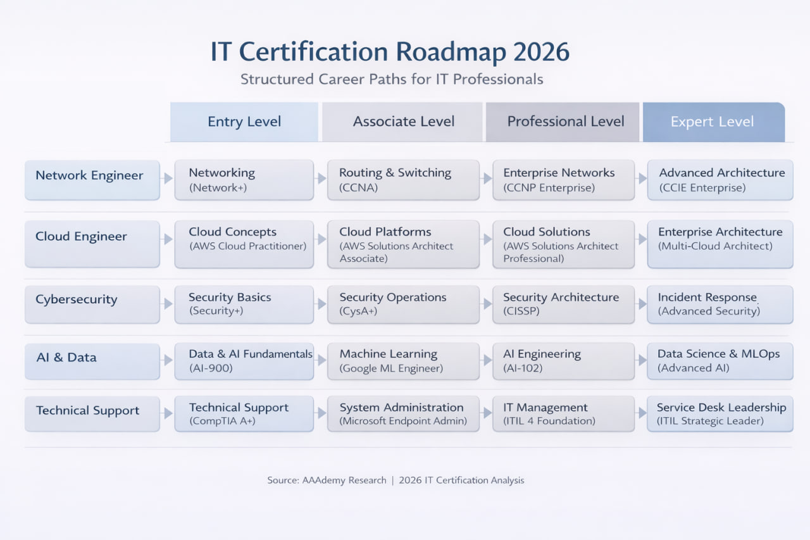

# IT Certification Roadmap 2026

Structured Career Paths for IT Professionals

---

## Overview

The IT Certification Roadmap 2026 provides a structured path for professionals aiming to advance their careers in:

- Network Engineering
- Cloud Engineering
- Cybersecurity
- AI & Data
- Technical Support

This roadmap is based on industry certification progressions from entry level to expert level.

---

## Roadmap Image

---

## Certification Levels Explained

### Entry Level
Fundamental certifications that build basic technical knowledge.

Examples:
- CompTIA Network+
- AWS Cloud Practitioner
- Security+
- AI-900
- CompTIA A+

---

### Associate Level
Role-focused certifications validating hands-on skills.

Examples:
- CCNA
- AWS Solutions Architect Associate
- CySA+
- Google ML Engineer
- Microsoft Endpoint Admin

---

### Professional Level
Advanced implementation and design skills.

Examples:
- CCNP Enterprise
- AWS Solutions Architect Professional
- CISSP
- AI-102
- ITIL 4 Foundation

---

### Expert Level
Architect-level or strategic certifications.

Examples:
- CCIE Enterprise
- Multi-Cloud Architect
- Advanced Security Architecture
- MLOps Engineering
- ITIL Strategic Leader

---

## Purpose of This Repository

This repository aims to:

- Provide a structured certification roadmap
- Help professionals plan career progression
- Share learning references and best practices
- Encourage open discussion about certification trends

---

